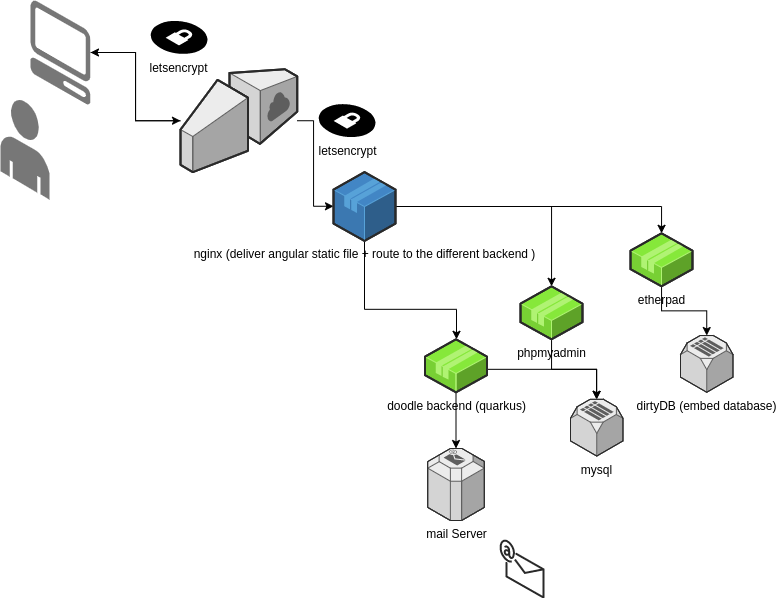
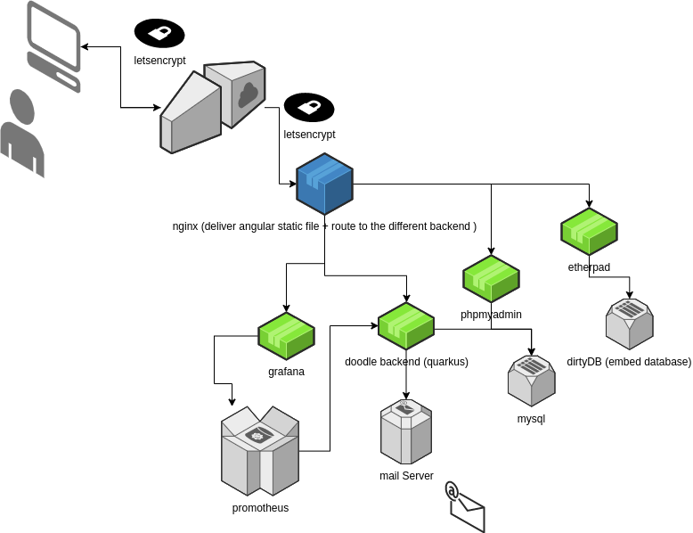
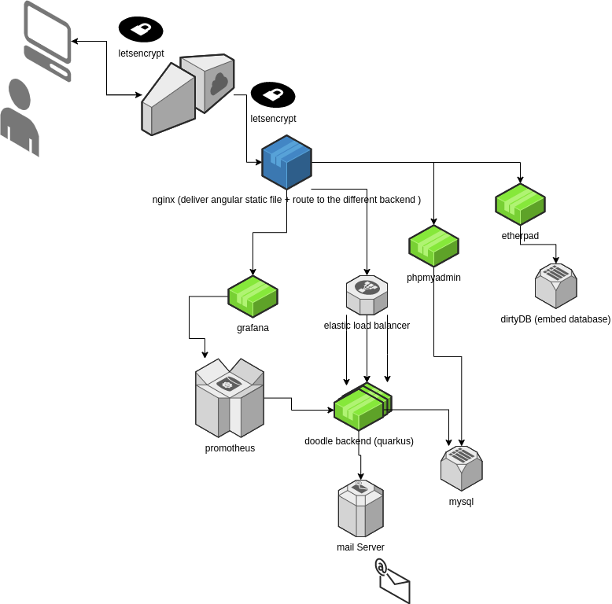

# Introduction

1. Présenation de l'application
2. Architecture de déploiement
3. Revue de code

---

# Etape 1 : Déploiement manuel

---
# Etape 2 : Déploiement avec docker

---

# Etape 3 : Déploiement avec microk8s

---

# Etape 4 : Intégrer une couche de monitoring

---

# Etape 5 : Intégrer la tolérance aux pannes

--  